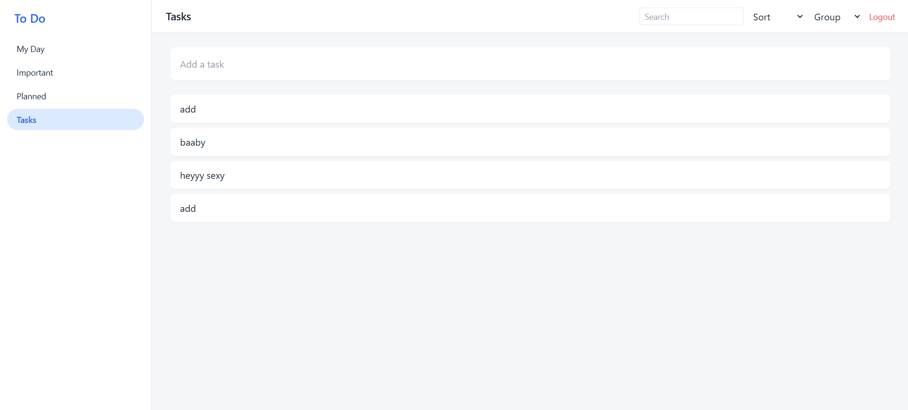

## 🚀 Features

### 🔐 Authentication & Security
- User Registration & Login (JWT-based authentication)
- Protected routes (each user accesses only their own tasks)
- Secure password hashing
- Logout functionality

---

### 📝 Advanced Task Management
- Create, edit, and delete tasks
- Mark tasks as Completed or Pending
- Assign categories:
  - Work
  - Personal
  - Urgent
  - Shopping
  - Health
- Set Threat Level / Priority:
  - Low
  - Medium
  - High
- Add deadline (due date picker)
- Add sub-objectives (subtasks)
- Add transmission notes (additional details)
- Archive completed tasks
- Real-time task updates

---

### 🧠 Intelligence Panel
- Expandable right-side task intelligence panel
- Dynamic category assignment
- Live priority adjustment
- Deadline modification
- Focus Mode activation
- Terminate record (task deletion control)

---

### 📊 Productivity Tracking
- Efficiency percentage tracker
- Weekly streak monitoring (S M T W T F S)
- Completed vs pending task tracking
- Visual productivity insights

---

### 🔎 Smart Filtering & Navigation
- Filter tasks by:
  - All
  - Work
  - Personal
  - Urgent
  - Shopping
  - Health
- Search tasks instantly
- Dedicated sections:
  - My Day
  - Important
  - Planned
  - Tasks
  - Archive

---

### 🎨 UI / UX
- Modern dark-themed dashboard interface
- Responsive design (mobile & desktop)
- Interactive sidebar navigation
- Smooth UI transitions
- Clean and minimal layout

- ## 📸 Screenshots

### 🏠 Dashboard View

---

### 🧠 Intelligence Panel

---

### 📊 Productivity & Sidebar

